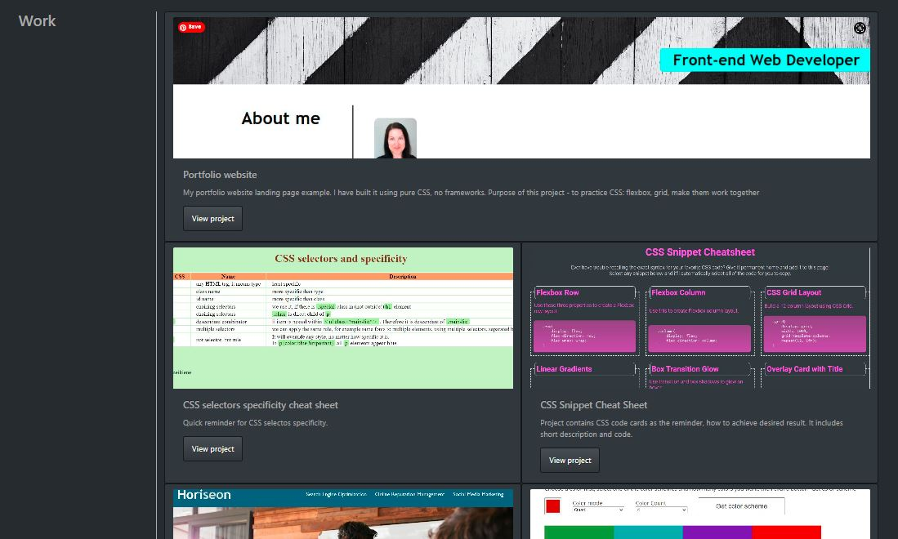
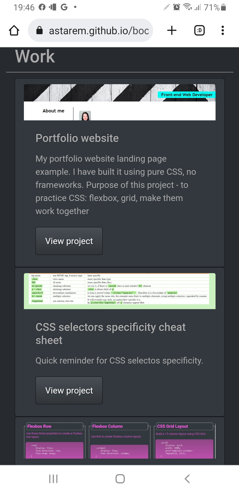

# Portfolio website, made with Bootstrap 4

## Description

 I have made my portfolio website using Bootstrap 4, customized it where needed. I have used Bootswatch.com for color themes.
 - top navigation and bottom navigation links take to relevant section on the page.
 - navigation link Resume takes to external site with Resume PDF file, available to download.
 - work section cards have button View project - on clicking a button, it takes to external website with deployed project.
 - Github, LinkedIn links and buttons take to external relevant site.
 - all links open in new window.
 - the grid layout is responsive and changes to one column view on smaller screens.
  
 **Medium(768px width) and bigger screens:**

 **Small(less than 768px width) screens:**
 

## Installation

No installation needed.

## Usage

You can view deployed project [here](https://astarem.github.io/bootstrap4-portfolio/).
